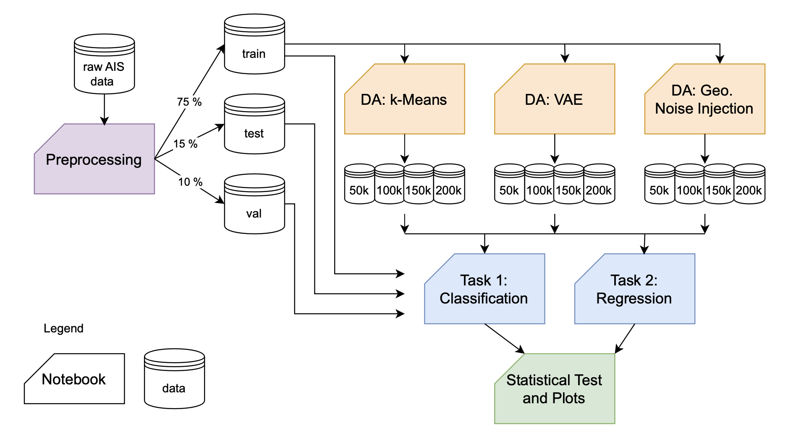

## Pipeline Overview

This repository provides the pipeline implementation for a project investigating whether Data Augmentation (DA) enhances Deep Learning (DL) prediction tasks and the relative effectiveness of various DA techniques. Below, you will find an overview of the pipeline, its stages, and instructions for reproducing the experiments.

The pipeline is divided into four main stages:
1. **Preprocessing**: Raw AIS data is cleaned, filtered, resampled, and interpolated.
2. **Data Augmentation**: Synthetic data is generated using three techniques: k-Means, Sequence-VAE, and Geographic Noise Injection.
3. **Deep Learning Models**: Two tasks are implemented: vessel classification and position prediction using LSTM models (regression).
4. **Statistical Evaluation**: Results are statistically analyzed and visualized.

### Pipeline Diagram

---

### 0. **Data**
The raw AIS data used in this project was sourced from the United States Coastal Office for Coastal Management. Due to size limitations, the data is not included in this repository. To replicate the experiments:

1. Download the AIS dataset from [https://coast.noaa.gov/htdata/CMSP/AISDataHandler/2023/index.html].

The preprocessing notebook will handle cleaning and splitting the data.
The data used in this study is: AIS_2023_01_01, AIS_2023_05_05, AIS_2023_08_04, AIS_2023_09_23, AIS_2023_12_14

## Stages and Implementation

### 1. Preprocessing
- Raw AIS data, sourced from the U.S. Coastal Office, is cleaned and prepared.
- Data cleaning involves:
  - Removing invalid values (e.g., SOG < 0, COG outside 0-360).
  - Filtering sparse trajectories and anomalous data.
- Resampling and interpolation ensure uniform time intervals, leveraging NumPy's interpolation function.
- Final datasets are split into training (75%), validation (15%), and testing (10%) sets, repeated across 10 seeds for statistical robustness.

### 2. Data Augmentation
Three DA techniques are applied to the training datasets:
- **k-Means**: Generates synthetic data by clustering original data and applying Gaussian noise around centroids.
- **Sequence-VAE**: Utilizes a Variational Autoencoder with LSTM layers to generate realistic synthetic sequences.
- **Geographic Noise Injection**: Injects controlled geographic perturbations into the trajectories.

### 3. Deep Learning Models
Two baseline models are implemented using TensorFlow/Keras:
- **Classification Model**: Predicts vessel type (tanker, passenger, tug) using an LSTM-based architecture with dropout layers.
- **Regression Model**: Predicts vessel position (LAT, LON) using a stacked LSTM architecture.
Both models are evaluated with and without augmented data to assess DA effectiveness.

### 4. Statistical Evaluation
- Results are evaluated statistically using the SciPy library.
- Visualizations are created with Matplotlib and Seaborn to illustrate performance across datasets and DA techniques.
